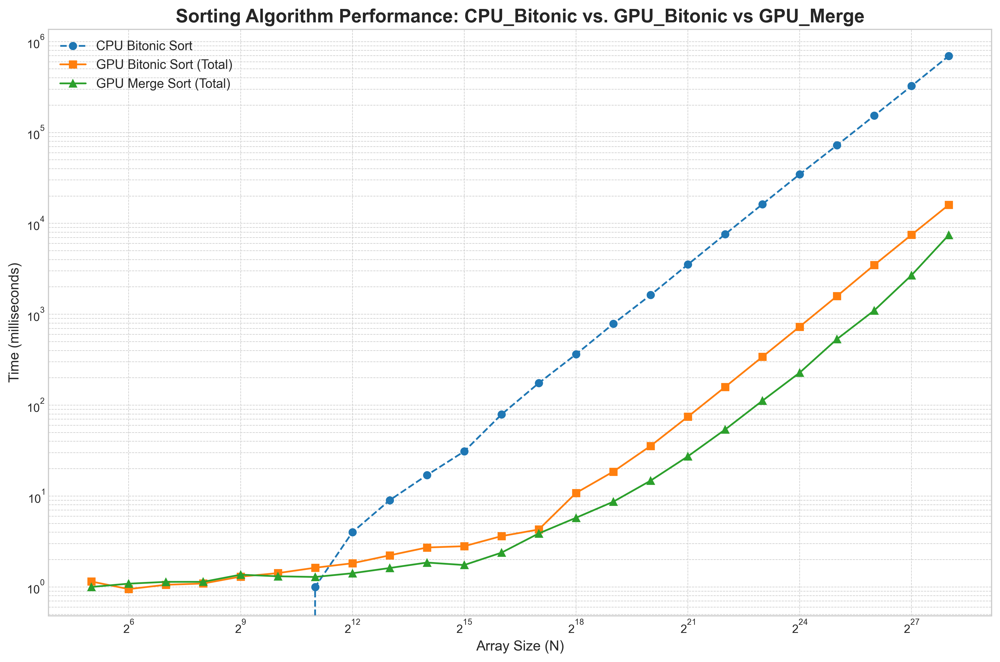

# CUDA Sorting Algorithm Benchmark: Bitonic vs. Merge Sort

## Algorithms Implemented
* **CPU Bitonic Sort:** A standard `O(N log²N)` implementation running on a single CPU core.
* **GPU Bitonic Sort:** A parallel implementation in CUDA C++.
* **GPU Merge Sort:** A parallel implementation in CUDA C++ using a binary search-based merge.
* A Python notebook (`plots.ipynb`) is included to visualize the benchmark data.

---
## Key Findings & Results
The benchmark revealed two key insights:
1.  **GPU vs. CPU:** As expected, the GPU massively outperforms the CPU for large datasets, achieving a **~50x speedup** for sorting ~16.7 million elements.
2.  **GPU vs. GPU:** Surprisingly, the parallel **Merge Sort was the decisive winner**, outperforming Bitonic Sort by over **2x** at large scales.

The conclusion is that while Bitonic Sort has theoretically ideal memory patterns for a GPU, the lower **total work complexity** of Merge Sort (`O(N log N)` vs. `O(N log²N)`) was the dominant factor in performance on this modern hardware.



---
## How to Run

### 1. Dependencies
* NVIDIA GPU with CUDA Toolkit (`nvcc`)
* Python 3
* Pandas (`pip install pandas`)
* Matplotlib (`pip install matplotlib`)

### 2. Compile and Run the Benchmark
The C++ code contains all sorting algorithms and the main benchmarking loop.
```bash
# Compile the CUDA code
nvcc -o bitonic_sort bitonic_sort.cu

# Run the benchmark (this will take several minutes and generate results.csv)
./bitonic_sort
